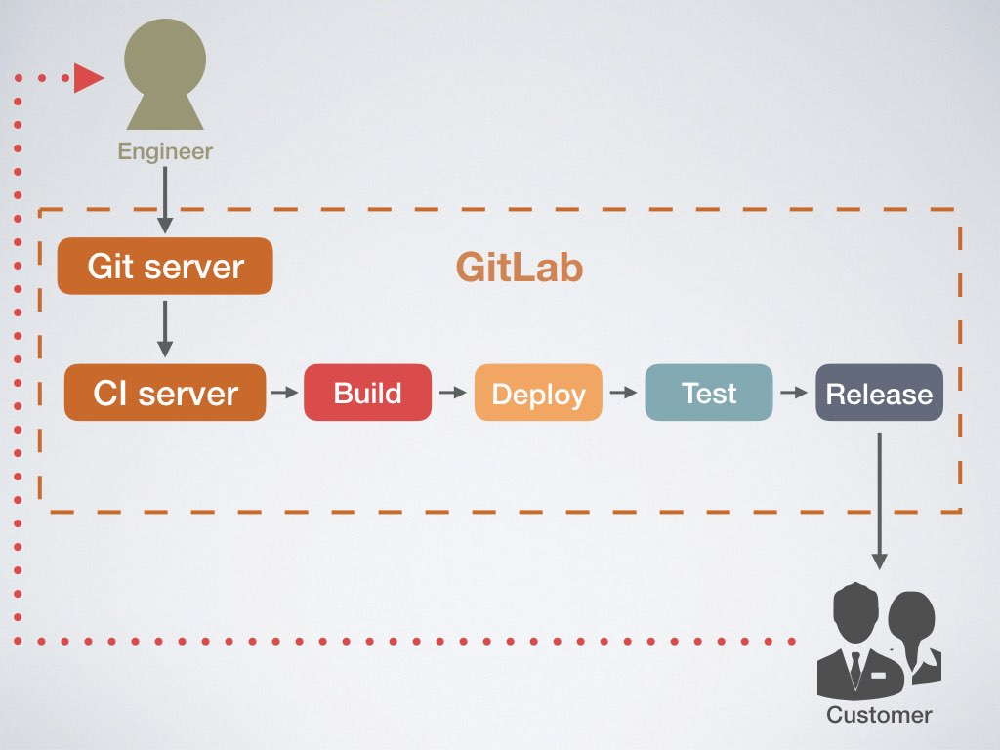

# Continuous Delivery Workshop with Ansible x GitLab CI

[](https://gitlab.com/chusiang/continuous-delivery-workshop/commits/master)

This is a **Continuous Delivery Lab**, and it's fork from [@chusiang/coscup2017-cd-demo](https://gitlab.com/chusiang/coscup2017-cd-demo).

## Overall


Loop (Engineer -> Git server -> CI server -> Build stage -> Deploy stage -> Test stage -> Release stage -> Customer).

## The Pipeline

### Build stage

Package the htdocs to deb file.

1. Architecture of deb file.

    ```
    $ tree penguin-htdocs
    penguin-htdocs
    ├── DEBIAN
    │   └── control
    └── var
        └── www
            └── html
                └── index.html

    4 directories, 2 files
    ```

1. Build the deb file on GitLab CI.

    ```
    $ dpkg -b penguin-htdocs
    ```

### Deploy stage

Deploy to staging node, and release to production node with `setup.yml` playbook.

```
$ ansible-playbook deploy.yml
```

### Test stage

Only test the staging with `test.yml` playbook on localhost.

```
$ ansible-playbook test.yml
```

### Release stage

Release to production node with `setup.yml` playbook, too.

```
$ ansible-playbook -i production deploy.yml
```

## Reference

### How to build the deb package.

1. [Deb Package 套件封裝教學 | Soul & Shell Blog](https://blog.toright.com/posts/4434/deb-package-%E5%A5%97%E4%BB%B6%E5%B0%81%E8%A3%9D%E6%95%99%E5%AD%B8.html)
1. [如何製作「deb 檔 (Debian Package)」 | Ubuntu Basic Skill](https://samwhelp.github.io/book-ubuntu-basic-skill/book/content/package/how-to-build-package.html)

### How to use the Ansible.

1. [《現代 IT 人一定要知道的 Ansible 自動化組態技巧》．GitHub](https://github.com/chusiang/automate-with-ansible)

### Reference slides

1. [Git and Github basic with SourceTree](http://note.drx.tw/2015/05/git-and-github-basic-with-sourcetree.html)
1. [現代 IT 人一定要知道的 Ansible 自動化組態技巧 (3/e)](http://note.drx.tw/2017/03/automate-with-ansible-basic-3e.html)
1. [前端工程師一定要知道的 Docker 虛擬化容器技巧](http://note.drx.tw/2016/07/virtualization-with-docker-container-basic-for-f2e.html)
1. [DevOps 人一定要知道的 Ansible & GitLab CI 持續交付技巧](http://note.drx.tw/2017/08/continuous-delivery-with-ansible-x-gitlab-ci.html)

## License

Copyright (c) [chusiang][chusiang] from 2017 under the MIT license.

[chusiang]: https://github.com/chusiang/
